# 2-Scala
1. [Funciones](#schema1)
2. [Simplificación de funciones](#schema2)
3. [Funciones lambda](#schema3)
4. [Transformaciones](#schema4)
5. [Bucles](#schema5)
6. [Bloques - POO](#schema6)
7. [Lista (List)](#schema7)
8. [Mapas (Maps)o diccionarios](#schema8)

# 1. Funciones
~~~scala
def obtenerCubo(x:Int): Int ={
    return x*x*x
}
val resultadoCubo = obtenerCubo(3)
println(s"El resultado del cubo es: ${resultadoCubo}")
~~~
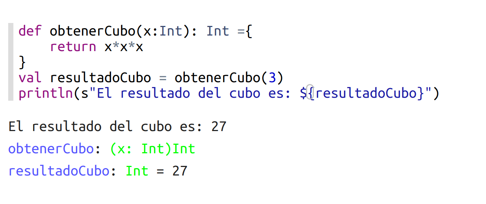

# 2.  Simplificación de funciones
1º No ponemos el tipo de retorno porque se infiere, en scala no se puede inferir los datos de entrada pero si los de salida
2º Se omite el bloque de código.

~~~scala
def obtenerCubo2(x:Int) =  x*x*x
val resultadoCubo2 = obtenerCubo2(3)
println(s"El resultado del cubo es: ${resultadoCubo2}")
~~~
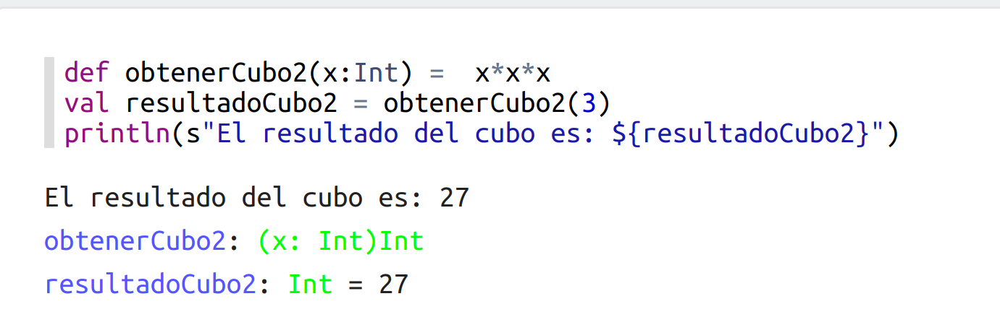

# 3. Funciones lambda
Una función lambda puede recibir como parámetro otra función y puede devolver otro función.
También conocidas por funciones anónimas, porque no tiene nombre ni def

~~~scala
def sumar(f:Int => Int)={
    f(3) //se puede poner el return o no.
}
sumar(obtenerCubo2)
~~~
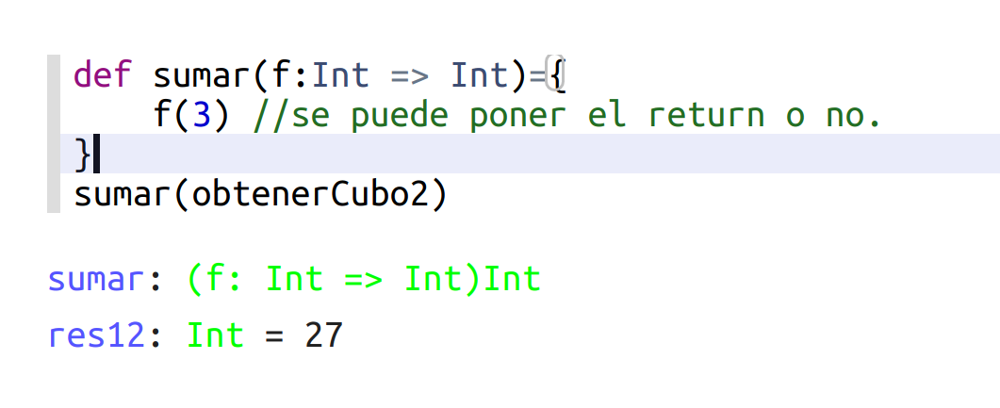

~~~scala
(x:Int =>x*2) 
~~~
función lambda o anónima, pero así no se trabaja pq se tiene que asociar a una variable
~~~scala 
val doblarSalarios = (x:Int)=> x*2
~~~

# 4. Transformaciones

~~~scala
//salarios de empleados
//colecciones : Secuencias
val salarios = Seq(3000,4000,6000,8000)

val doblarSalarios = (x:Int)=> x*2
val salarioDoblados = salarios.map(doblarSalarios)

~~~
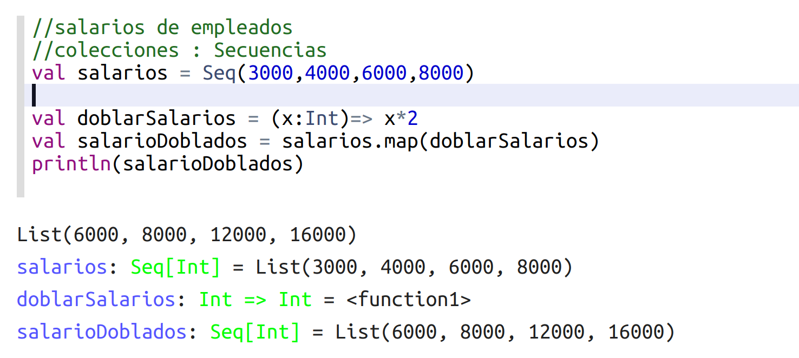

Nos ahorramos el declarar una variable ya que con `.map` mapeamos a todos los elementos de salarios los que nos dice la función
~~~scala
val salarios = Seq(3000,4000,6000,8000)
val salarioDoblados = salarios.map(x => x*2)

~~~
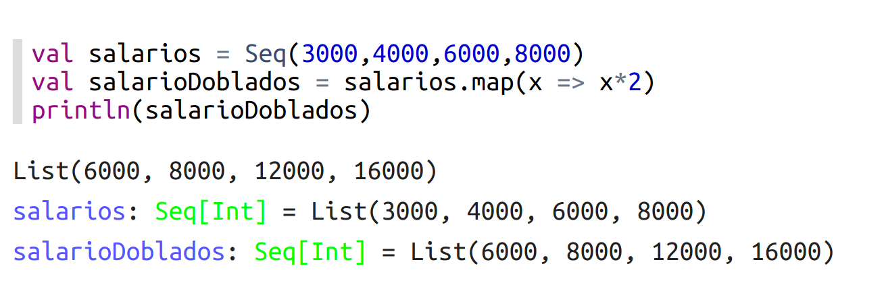

# 5. Bucles
~~~scala
for (i <- 1 until 3){
    println(i + "*")
}
~~~
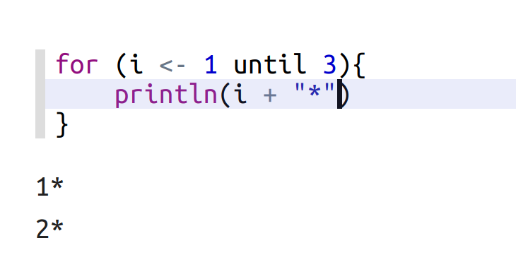

Bucles anidados
Hay dos formas de hacerlo, esta primera es la más habitual.
~~~scala
for (i <- 1 until 3; j <- "abc"){
    println(s"${i} ${j}")
}
~~~
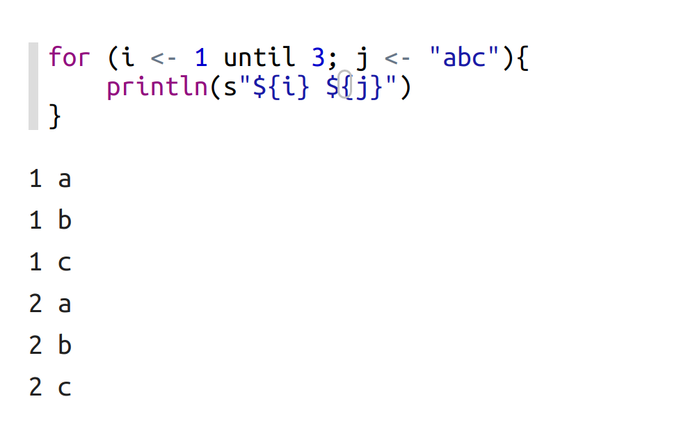

~~~scala
(1 until 3).foreach{
    i => "abc".foreach{
        j => println(s"${i} ${j}")
    }
}
~~~

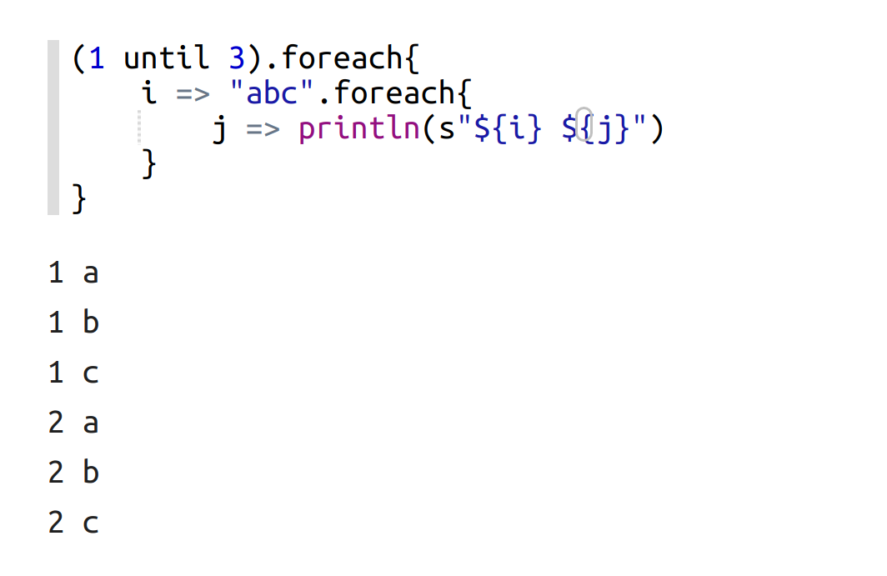

# 6. Bloques - POO
- Bloques
~~~scala
println("Hola mundo")
~~~

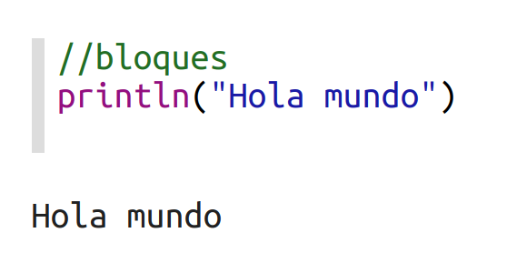
~~~scala
println({
    val x = 1 + 1
    x + 1 
})
~~~
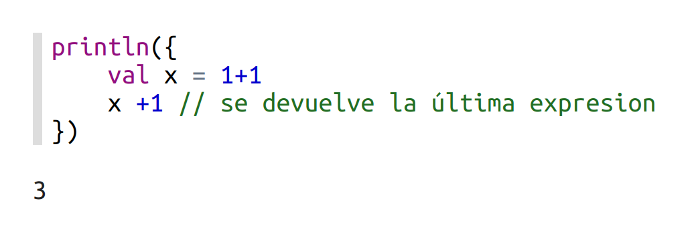
- POO

Las clases en scala se declaran con la palabra `class`
Pero hay un tipo especial que son las `case class` son clases que solo tiene info.
~~~scala
case class Punto(x : Int, y : Int)
val punto = Punto(1,2)
val otroPunto = Punto(3,7)
~~~
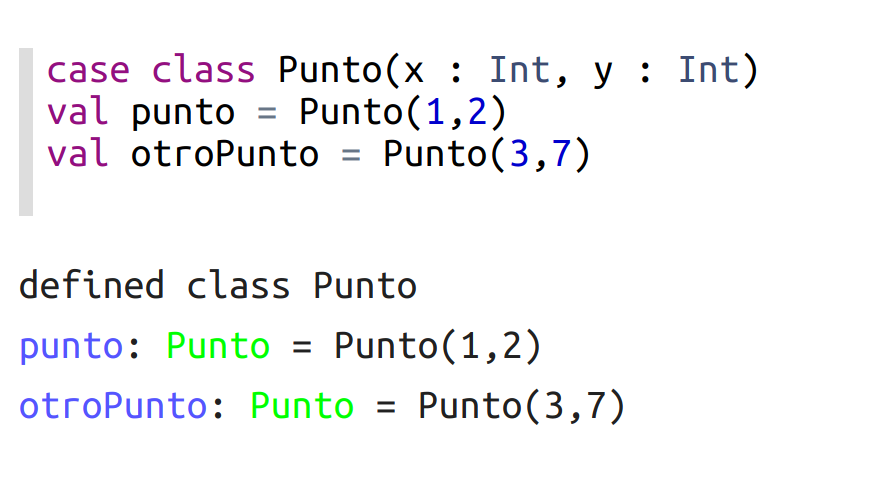

~~~scala
case class Usuario(nombre: String, edad : Int)
val juan = Usuario("Juan", 45)
val maria = Usuario("Maria",34)
~~~
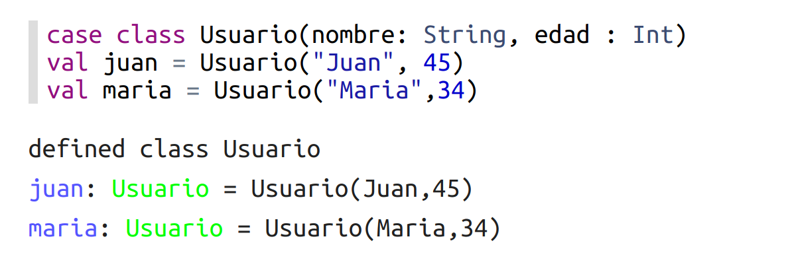

# 7. Lista (List)
~~~scala
val juan = Usuario("Juan", 45)
val maria = Usuario("Maria",34)
val pedro = Usuario("Pedro",67)
~~~
~~~scala
val usuarios = List(juan, maria, pedro)
val primerUsuario = usuarios(0) //primer valor
~~~
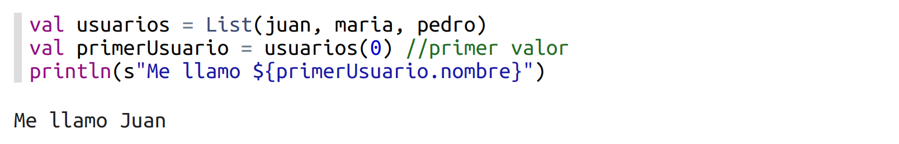
Podemos iterar sobre las listas

~~~scala
for(usuario <- usuarios){
    println(s"Nombre usario ${usuario.nombre} de edad ${usuario.edad}")
}
~~~
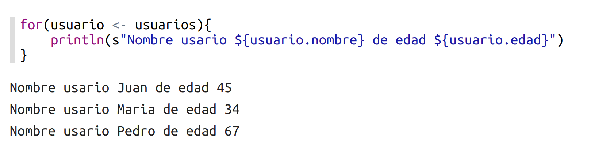

# 8. Mapas (Maps) o diccionarios
Los `Map`se inicializan:
**val nomnbre_coleccion = Map(clave->valor)**
Y se acceden a través de la clave
~~~scala
val miColeccion = Map("a"->34, "b"->12)
val datoA = miColeccion.get("a")
~~~
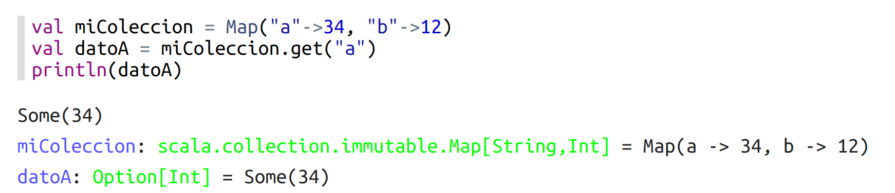